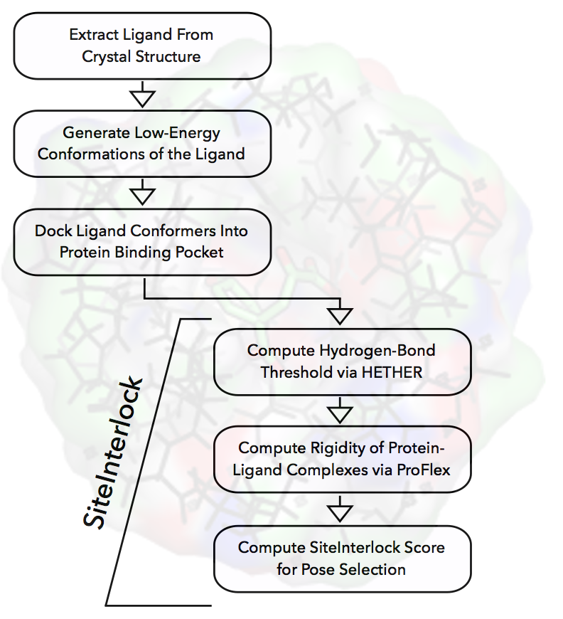

 

***A novel approach to pose selection in protein-ligand docking based on graph theory.***

`siteinterlock` is a Python package for selecting near-native protein-ligand docking poses based upon the hypothesis that interfacial rigidification of both the protein and ligand prove to be important characteristics of the native binding mode and are sensitive to the spatial coupling of interactions and bond-rotational degrees of freedom in the interface.

The `siteinterlock` package was developed by [Sebastian Raschka](http://sebastianraschka.com) in the
[Protein Structural Analysis & Design Laboratory](http://www.kuhnlab.bmb.msu.edu)
at Michigan State University. For additional information on the theory
behind the SiteInterlock project, please refer to the accompanying research publication:

- Raschka, Sebastian, Joseph Bemister‐Buffington, and Leslie A. Kuhn.
["Detecting the native ligand orientation by interfacial rigidity: SiteInterlock."](http://onlinelibrary.wiley.com/doi/10.1002/prot.25172/full)
*Proteins: Structure, Function, and Bioinformatics* 84.12 (2016): 1888-1901.

 
 

The following flowchart provides you with a quick overview of the SiteInterlock approach. Please read the [Installation Notes](installation/index.html) and [Documentation](user_guide/index.html) for more details on how to use this software package, and it is recommended the accompanying [research article](cite/index.html) for details of the SiteInterlock hypothesis and theory.

