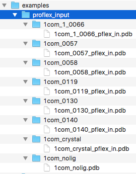
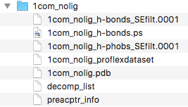
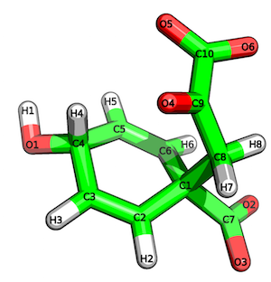
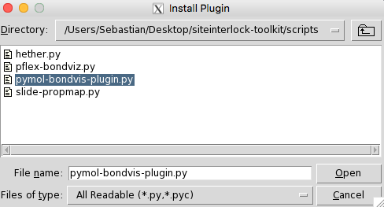
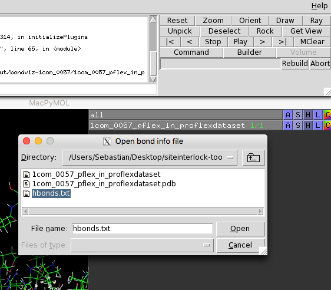
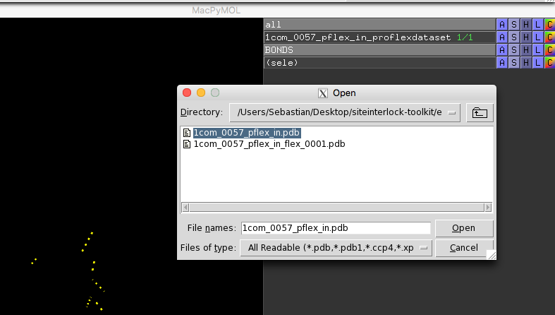
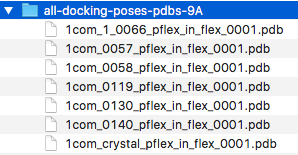
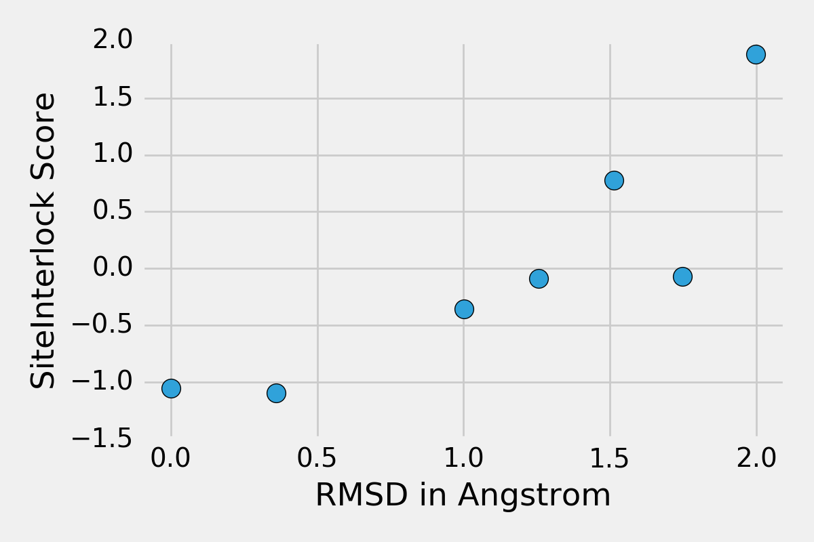

# User Guide Overview

This user guide covers the basic usage of the`siteinterlock` package using a re-docking example of based on a protein-ligand crystal complex of monofunctional chorismate mutase and prephenic acid (PDB code: [1com](http://www.rcsb.org/pdb/explore/explore.do?structureId=1com) [[1](#references)]). The files we will be working with in this tutorial are located in the `examples/` subdirectory of the `siteinterlock` package.

The following flowchart highlights a typical workflow of a re-docking study, and this guide assumes that you already completed steps 1-3 and  prepared protein-ligand docking poses using your preferred docking tool, for example, [AutoDock Vina](http://vina.scripps.edu) [[2](#references)]. In the following sections, will work with a small set of 6 exemplary docking poses of 1com, which we generated via OpenEye OMEGA2 [[3](#references)]) and MSU SLIDE [[4](#references)]), to illustrate the use of the `siteinterlock` package for near-native binding pose selection (steps 3-6).


<br>
<br>

# 1 - Organizing Protein Docking Poses as PDB files

In this section, we will prepare our docking poses for rigidity analysis in [[ProFlex](#references)].

We recommend you to organize the docking poses for re-scoring in a directory structure similar to the one that is shown in the screenshot below.



As illustrated in the preceeding figure, we create a separate directory that contains one docking pose each. These PDB files will later serve as inputs to ProFlex. Each input file should contain the protein structure in PDB file as well as the docked ligand. Please also make sure that the respective structures are protonated, which is required by ProFlex. Also, you need to prepare a "ligand-free" structure of the protein, which we labeled `1com_nolig`. If you have further questions about the required file format, please take a look at the "1com" example files, which are located in the `examples/proflex_input/` subdirectory.

<br>
<br>

# 2 - Determining a Reasonable Energy Cut-Off for Hydrogen Bonds in ProFlex

Before we analyze the rigidity of the docking poses via ProFlex, we use HETHER (Hydrogen-bond Energy ThresHold Estimator for Rigidity analysis) to select the optimal hydrogen-bond energy value for ProFlex analysis. Based on the ligand-free crystal structure, HETHER determins which salt bridges and hydrogen bonds will be included in the atomic interaction network. For more details about the HETHER algorithm, please refer to the SiteInterlock research publication [6].

To run the HETHER analysis, go into the `examples/proflex_input/1com_nolig` and run ProFlex via the following command:

```
proflex -h 1com_nolig.pdb
```

When ProFlex prompts you with question, you may use the default options for analyzing the rigidity of this structure. When the following analysis menu comes up

---

<pre>
    ANALYSIS MENU

  What would you like to perform:

    (1) Flexibility and rigidity analysis
    (2) Hydrogen bond dilution
</pre>

---

enter `2` and press <Enter>. When you see the next menu:


---
<pre>

Which hydrogen bond dilution analysis would you like?

 (1) Standard hydrogen bond dilution, removing weakestH-bonds, one at a time

 (2) Random dilution over all H-bonds.
     NOTE: This option is *not* recommended;
           It may be used to probe the influence of H-bond
           density, as opposed to strength, on rigidity

</pre>
---

enter `1` and confirm this choice by pressing <Enter> again to execute
a "Hydrogen bond dilution analysis." If the analysis finished successfully, you can inspect the results of the dilution analysis by opening the post script image file `1com_nolig_h-bonds.ps` that was created in the `1com_nolig` directory:



 (Example output files are located in the `examples/proflex_output/hbdilute-1com_nolig/` subdirectory).

Finally, we can use HETHER to suggest an energy threshold for the hydrogen-bond network. We execute the `hether.py` script from `siteinterlock`'s scripts directory and provide 2 input files, the `1com_nolig_proflexdataset` file and the `decomp_list` file, which were both created via the hydrogen-dilution analysis. The complete command is as follows:

```bash
python scripts/proflex_hether.py \
 --input1 examples/proflex_output/1com_nolig/1com_nolig_proflexdataset \
 --input2 examples/proflex_output/1com_nolig/decomp_list
```

As a result, you will see the following output on your command line terminal:

<pre>
#
# SiteInterlock version 1.0.0
# Timestamp: 2016-08-19T19:36:47
#
==============
HETHER results
==============
Suggested energy threshold: -0.806 kcal/mol
Number of rigid clusters: 4
Relative rigidity [0, 1]: 0.83
</pre>

Which you should save for your reference. For your convenience, you may want to use the `>` operator in your Linux/Unix shell to redirect the output to a file.

```bash
python scripts/proflex_hether.py \
 --input1 examples/proflex_output/1com_nolig/1com_nolig_proflexdataset \
 --input2 examples/proflex_output/1com_nolig/decomp_list > hether.log
```

As we can see from the previous output, HETHER suggests an energy threshold of -0.806 kcal/mol, which corresponds to the protein state that is indicated by an black arrow in the following hydrogen-dilution plot figure:


<br>
<br>

# Optional: Visualizing Rigid and Flexible Clusters in PyMOL

In this section, we will walk through an optional step to visualize the rigid cluster composition via ProFlex in [PyMOL](https://www.pymol.org) using the energy threshold we determined in the previous section based on the ***ligand-free*** structure. Now, we will perform a "flexibility and rigidity analysis" at this energy threshold via ProFlex. Similar to our previous ProFlex run, we start the analysis by executing

```
proflex -h 1com_nolig.pdb
```

This time, when you are prompted to enter an energy cut-off, use the one suggested by HETHER instead of the default setting and hit enter:

<pre>
Number of H-bonds remaining: 202

Number of H-phobic tethers remaining: 166

		 Filter on Hydrogen Bond Energy:
		 ~~~~~~~~~~~~~~~~~~~~~~~~~~~~~~~

	All current hydrogen bonds have energies between:
	    -9.8419 Kcal/Mol  to  0.0226 Kcal/Mol

	Enter a maximum acceptable hydrogen bond energy (in Kcal/Mol)
	(-1.0 is a reasonable cutoff in general): -0.806
</pre>

When the next menu comes up, enter `1` and continue by confirming your choice via the <Enter> button:

<pre>
ANALYSIS MENU

What would you like to perform:

(1) Flexibility and rigidity analysis
(2) Hydrogen bond dilution
</pre>

After the flexibility analysis has completed, you should find the following files in the `1com_nolig` directory:


Next, open the file `1com_nolig_flex_0001.pdb` in PyMOL. This PDB file represents the protein structure after ProFlex analysis, which we can use to visualize the predicted flexible, isostatic, and rigid cluster according to the following color scale:


Now, click on the "File" menu in PyMOL, select "Run" from the dropdown menu, and open the `scripts/pymol_pflex_color.pml`.


You should now see the protein structure with its predicted flexible and rigid regions:


<br>
<br>

# 3 - Analyzing Docking Poses via ProFlex

Now that we computed a reasonable hydrogen-bond cut-off based on the ***ligand-free*** protein structure in section 2, we can use this suggested cut-off value for our ProFlex analysis of the docking poses. ProFlex requires additional information about hydrogen-donor and acceptor atoms for non-protein atoms. If you used MSU SLIDE for docking, `siteinterlock` includes a script, `slide_propmap.py`, to obtain this information from SLIDE's .pts file.


For instance, you can provide a MOL2 file of the ligand, prephenic acid (shown below)



and the .pts file of the docked ligand to `slide-propmap.py`:

```bash
python scripts/slide_propmap.py \
--input1 examples/slide-propmap/1com_crystal.mol2 \
--input2 examples/slide-propmap/1com_0.pts
```

The resulting output in this case should be as follows:

```
#
# SiteInterlock version 1.0.0
# Timestamp: 2016-08-19T20:15:54
#
================
PROPMAP results
================
C1 --> hydrophobic contact
C3 --> hydrophobic contact
C5 --> hydrophobic contact
C8 --> hydrophobic contact
O1 --> b [H-bond Donor and/or Acceptor]
O2 --> a [H-bond Acceptor]
O3 --> a [H-bond Acceptor]
O4 --> a [H-bond Acceptor]
O5 --> a [H-bond Acceptor]
O6 --> a [H-bond Acceptor]
```

Please save this information for your records, since we will require it for the following ProFlex analysis. For your convenience,
you may want to use the `>` operator in your Linux/Unix shell to redirect the output to a file.

If you didn't use SLIDE for docking and don't have a chemistry-related background, you may want to use a different tool to obtain the required donor and acceptor atom information or consult a chemist.

After we acquired the information about the ligand's donor and acceptor atoms, we have to run the ProFlex flexibility analysis on each of our docking poses. For instance, to run the ProFlex analysis on the crystal structure in `examples/proflex_input/proflex_input/1com_crystal` by executing `proflex -h 1com_crystal_pflex_in.pdb` in the respective directory. When we are prompted to enter donor and acceptor information, we provide the previously obtained information as shown in the example below:

---

<pre>
---------------------------------------------------------
	Identification of H-bond Donors, Acceptors etc.

	(d) H-bond Donor
	(a) H-bond Acceptor
	(b) Both H-bond Donor and H-bond Acceptor
	(c) Charged Donor
	(e) Charged Acceptor
	(n) None
---------------------------------------------------------
	Enter (a,b,c,d,e or n) for the following atoms.

	 Atom#  Atom  Res    Res#    Chain
	 3755    O1   <0>       1          Enter (a,b,c,d,e or n): b
	 3757    O2   <0>       1          Enter (a,b,c,d,e or n): a
	 3759    O3   <0>       1          Enter (a,b,c,d,e or n): a
	 3761    O4   <0>       1          Enter (a,b,c,d,e or n): a
	 3763    O5   <0>       1          Enter (a,b,c,d,e or n): a
	 3765    O6   <0>       1          Enter (a,b,c,d,e or n): a
</pre>

---

When we are prompted to enter an energy threshold for hydrogen-bonds, we provide the value that we obtained from the ligand-free structure (`1com_nolig`) that we computed via HETHER in section 2 and run the flexibility analysis by entering `1` when the following ProFlex prompt comes up:

---

<pre>

    ANALYSIS MENU

  What would you like to perform:

    (1) Flexibility and rigidity analysis
    (2) Hydrogen bond dilution

</pre>

---

After running the ProFlex flexibility analysis on each of the 6 docking poses and crystal structure, we should now have 7 ProFlex output PDB files that we collect in a single directory (example files are provided in `examples/proflex_output/all-docking-poses-pdbs`):


Optionally, we can visualize the results of the flexibility analysis by following the instructions described in the previous secion *Optional: Visualizing Rigid and Flexible Clusters in PyMOL*. For instance, the flexible and rigid clusters from `1com_0057_pflex_in_flex_0001.pdb` are shown as an example below, where blue regions represent rigid clusters, gray regions represent isostatic clusters, and yellow, orange, and red regions indicate flexible clusters.


# Optional: Visualizing H-bond Interactions between Proteins and Ligands

Optionally, we can use one of `siteinterlock`'s utilities to visualize the hydrogen bond interactions in the current docking pose as deduced via ProFlex. First, we need to install the `pymol_bondvis-plugin.py` provided in the `siteinterlock`'s `scripts` directory. As shown in the two figures below, click on the "Manage Plugins" (if you have it enabled in your PyMOL version) and select the plugin script mentioned above.




Then restart your PyMOL application. Next, run the command

```bash
python scripts/pflex-bondviz.py \
-i examples/proflex_output/1com_0057/1com_0057_pflex_in_proflexdataset \
-b hbonds
```

which will produce the following output on your command line screen:

```
Atom#1 Atom#2
1951 3761
1949 3755
3269 3759
3566 3755
3266 3761
1185 3765
```

Copy and paste these results into a new text file or run the command again and pipe the output to a file, e.g., `hbonds.txt`.
Now, reopen PyMOL, rename `1com_0057_pflex_in_proflexdataset` to `1com_0057_pflex_in_proflexdataset.pdb` and open this PDB file in your current PyMOL session. Next, select the BondViz plugin from PyMOL's plugin menu, and select the `hbonds.txt` file that we just created:



Then, open the PDB file that we provided as input to ProFlex, e.g., `1com_0057_pflex_in.pdb` to visualize the hydrogen-bond network between the protein and it's docked ligand:





<br>
<br>

# 4 - SiteInterlock Scoring and Pose Selection

After working through the necessary preparation steps described in sections 1-3, we can use the ProFlex output files to compute the SiteInterlock ranking scores for pose selection.

First, we need to extract substructures of the protein-ligand complexes that contain the atoms of the ligand itself and all protein atoms within a 9-Angstrom radius of the ligand's heavy atoms. To accomplish this, we execute the `get-substructures.py` script from siteinterlock's `script` directory as follows:

```bash
python scripts/get-substructures.py \
--input examples/proflex_output/all-docking-poses-pdbs/ \
--output examples/proflex_output/all-docking-poses-pdbs-9A/ \
--ligand "<0>" \
--apply_to_dir
```

where `examples/proflex_output/all-docking-poses-pdbs/` is a directory containing the ProFlex output PDBs that is shown in the screenshot at the end of section 3. Via the `--ligand` flag, we specify the residue name of the docked ligand. Here, we use the placeholder name "<0>", which refers to the prephenic acid ligand in these particular PDB files we are working with. Finally, via the `--apply_to_dir` flag, we specify that we want to apply the `scripts/get-substructures.py` to all structures in the input directory so that we don't have to run the same script multiple times, for instance, on each individual PDB file.

After running the script as described above, you should know find the following files in the specified output directory:



If you open these files in PyMOL, you should see the ligand and the respective 9 Angstrom substructure of the protein; its atoms that fall within 9 Angstrom of the ligand's heavy atoms:


After we obtained these substructures, we run the `siteinterlock-score.py` script providing the substructure directory as input:

```bash
python scripts/siteinterlock-score.py \
-i examples/proflex_output/all-docking-poses-pdbs-9A/
```

As a result, you should now see the following SiteInterlock scores on your command line terminal:

```bash
#
# SiteInterlock version 1.0.0
# Timestamp: 2016-08-19T21:56:56
#
# ==============================
# SiteInterlock Scoring Results
# ==============================
Filename,SiteInterlock_Score
1com_0057_pflex_in_flex_0001.pdb,-1.094
1com_crystal_pflex_in_flex_0001.pdb,-1.053
1com_0140_pflex_in_flex_0001.pdb,-0.357
1com_0058_pflex_in_flex_0001.pdb,-0.087
1com_0119_pflex_in_flex_0001.pdb,-0.070
1com_1_0066_pflex_in_flex_0001.pdb,0.776
1com_0130_pflex_in_flex_0001.pdb,1.885
```
These results are sorted by ascending order, and the ***lowest, most negative value represents the best prediction.***

Since we worked through this tutorial as a re-docking study, we can compute the root mean square deviation (RMSD) between each docking pose and the crystal pose, `1com_crystal`. The following figure shows these SiteInterlock scores plotted against the RMSD from the crystal ligand pose:



<br>
<br>

# References

1. Chook, Yuh Min, et al. "The monofunctional chorismate mutase from Bacillus subtilis: structure determination of chorismate mutase and its complexes with a transition state analog and prephenate, and implications for the mechanism of the enzymatic reaction." *Journal of molecular biology* 240.5 (1994): 476-500.
2. Hawkins, Paul CD, et al. "Conformer generation with OMEGA: algorithm and validation using high quality structures from the Protein Databank and Cambridge Structural Database." *Journal of chemical information and modeling 50.4* (2010): 572-584.
3. Trott, Oleg, and Arthur J. Olson. "AutoDock Vina: improving the speed and accuracy of docking with a new scoring function, efficient optimization, and multithreading." *Journal of computational chemistry* 31.2 (2010): 455-461.
4. Zavodszky, Maria I., and Leslie A. Kuhn. "Side‐chain flexibility in protein–ligand binding: The minimal rotation hypothesis." *Protein Science* 14.4 (2005): 1104-1114.
5. Jacobs, Donald J., et al. "Protein flexibility predictions using graph theory." *Proteins: Structure, Function, and Bioinformatics* 44.2 (2001): 150-165.
6. [SiteInterlock Citation]
