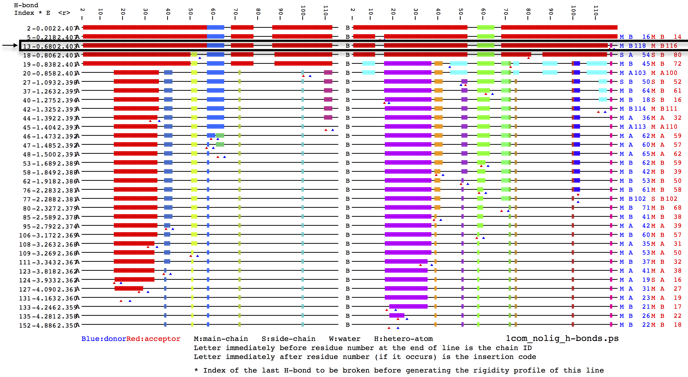
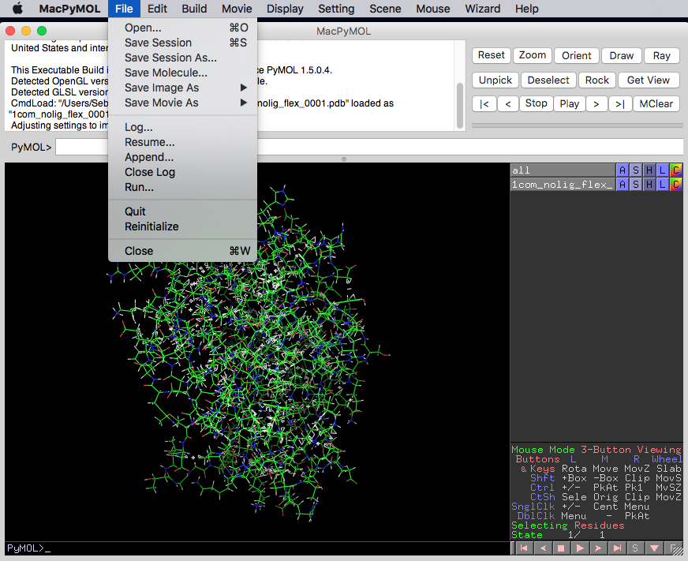
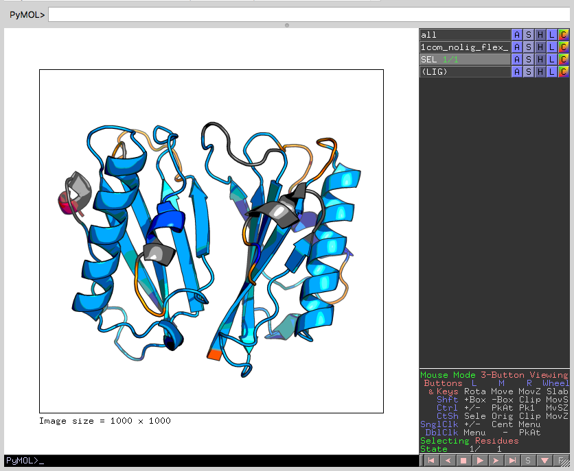
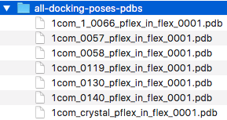
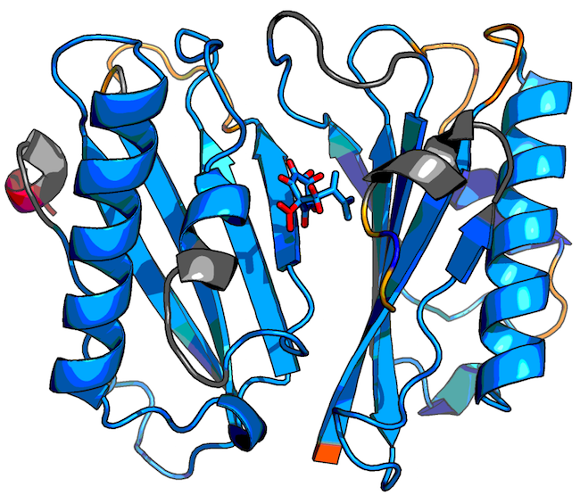
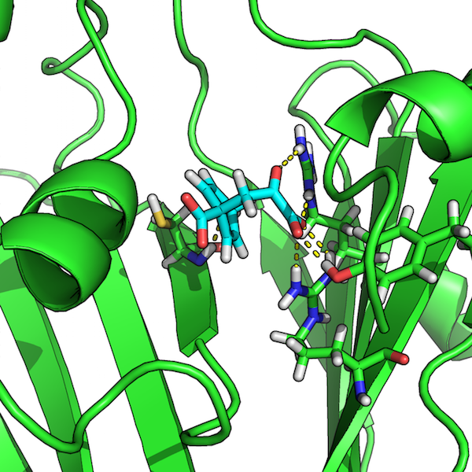

# User Guide Overview

This guide shows you how to use `siteinterlock` in a typical scoring and pose
selection in a typical docking study. The examples used in this guide are based
on a small re-docking study of the protein-ligand crystal complex of
monofunctional chorismate mutase and prephenic acid (PDB code:
[1com](http://www.rcsb.org/pdb/explore/explore.do?structureId=1com)
[[1](#references)]).
The files we will be working with in this tutorial are located in the
`examples/` subdirectory<br> of the `siteinterlock` package.   

The subsequent flowchart highlights a typical workflow of a re-docking study
via `siteinterlock`, and this guide assumes that you already completed steps
1-3 and prepared protein-ligand docking poses using your preferred docking
tool; for example, [AutoDock Vina](http://vina.scripps.edu) [[2](#references)].
In the following sections, we will only consider a representative subset of
docking poses of 1com for clarity when illustrating the use of the
`siteinterlock` package for near-native binding pose selection (steps 3-6).
These docking poses used in this guide were previously generated via
[OpenEye OMEGA2](http://www.eyesopen.com/omega) [[3](#references)] and
[MSU SLIDE](http://www.kuhnlab.bmb.msu.edu/software/slide/index.html)
[[4](#references)].


<br>
<br>

# 1 - Organizing Protein Docking Poses as PDB files

In this first section, we will prepare our docking poses for rigidity
analysis in
[ProFlex](http://www.kuhnlab.bmb.msu.edu/software/proflex/index.html)
[5](#references). We recommend you to organize the docking poses for
re-scoring in a directory structure similar to the one that is shown
in the screenshot below.


As illustrated in the preceding figure, we will create a separate directory
that contains one docking pose each. These PDB files will later serve as
inputs to ProFlex. Each input file should contain the protein structure in
[PDB-file format](http://www.rcsb.org/pdb/static.do?p=file_formats/pdb/index.html)
including the docked ligand.
***Please make sure that the protein-ligand complexes in these PDB files are protonated***,
which is required by ProFlex. In addition, we need to prepare
a "ligand-free" structure of the protein, which we labeled `1com_nolig`.
If you have further questions about the required file format,
please take a look at the "1com" example files, which are located
in the `examples/proflex_input/` subdirectory.

<br>
<br>

# 2 - Determining a Reasonable Energy Cut-Off for Hydrogen Bonds in ProFlex

Before we analyze the rigidity of the docking poses via ProFlex, we use
HETHER (Hydrogen-bond Energy ThresHold Estimator for Rigidity analysis)
to select the optimal hydrogen-bond energy value for ProFlex analysis.
Based on the ligand-free crystal structure, HETHER determines which salt
bridges and hydrogen bonds will be included in the atomic interaction network.
For more details about the HETHER algorithm, please refer to the SiteInterlock
research publication [[6](#References)]. Using HETHER can be understood as a
calibration step, since protein structures are being solved in different
solvents, at different temperatures and pressures.
Please note that ***we use the ligand-free structure for the HETHER analysis***,
to represent the real-world case of a docking study where the protein-ligand
crystal complex may not be available.


Before we can run the HETHER analysis, though, we need to run ProFlex's
'hydrogen-bond dilution' analysis;
we navigate to the `examples/proflex_input/1com_nolig`
directory and run ProFlex via the following command:

```
proflex -h 1com_nolig.pdb
```

When ProFlex prompts us with questions, we use the default options for
analyzing the rigidity of this structure. When the following analysis
menu comes up:


<div class='proflex'>
<pre>
    ANALYSIS MENU

  What would you like to perform:

    (1) Flexibility and rigidity analysis
    (2) Hydrogen bond dilution
</pre>
</div>

we enter `2` and hit the `<Enter>` button to select hydrogen bond
dilution as the type of analysis. When the following next menu appears


<div class='proflex'>
<pre>

Which hydrogen bond dilution analysis would you like?

 (1) Standard hydrogen bond dilution, removing weakest H-bonds, one at a time

 (2) Random dilution over all H-bonds.
     NOTE: This option is *not* recommended;
           It may be used to probe the influence of H-bond
           density, as opposed to strength, on rigidity

 </pre>
 </div>

we enter `1` and confirm via `<Enter>`, which will execute
a "Hydrogen bond dilution analysis." When the analysis finishes successfully,
we can inspect the results of the dilution analysis by opening the post
script image file `1com_nolig_h-bonds.ps` that was created in the `1com_nolig`
directory (Example output files are located in the
  `examples/proflex_output/hbdilute-1com_nolig/` subdirectory):


Finally, we can use HETHER to select the most appropriate energy threshold
for the hydrogen-bond network to use with ProfFlex for SiteInterlock analysis.
We execute the `hether.py` script from `siteinterlock` scripts directory and
provide two input files, the {add a line break
here so that the file name isn't split in the middle of a word}
`1com_nolig_proflexdataset` file and the `decomp_list` file, which were
both created via the hydrogen-bond dilution analysis. To run HETHER,
we execute the following command:


```bash
python scripts/proflex_hether.py \
 --input1 examples/proflex_output/1com_nolig/1com_nolig_proflexdataset \
 --input2 examples/proflex_output/1com_nolig/decomp_list
```

As a result, we should see the following output on our command line terminal:

<div class='proflex'>
<pre>
#
# SiteInterlock version 1.0.0
# Timestamp: 2016-08-19T19:36:47
#
==============
HETHER results
==============
Suggested energy threshold: -0.806 kcal/mol
Number of rigid clusters: 4
Relative rigidity: 83.0%
</pre>
</div>

The relative rigidity value measures the percentage of all C-alphas
in the protein that are in rigid regions. To save this information for our
records, we can copy this output it to a text or log file of choice.
More conveniently, we can use the  redirect operator `>` of our
Linux/Unix shell to redirect outputs of siteinterlock scripts to files.
For example,

```bash
python scripts/proflex_hether.py \
 --input1 examples/proflex_output/1com_nolig/1com_nolig_proflexdataset \
 --input2 examples/proflex_output/1com_nolig/decomp_list\
 > examples/proflex_output/1com_nolig/hether.log
```

We recommend using tee (if your shell environment supports it)
so that you can show the siteinterlock script outputs on your terminal
screen (`stdout`) and also save it to a log file (`redirect`)
without executing the same command twice:

```bash
python scripts/proflex_hether.py \
 --input1 examples/proflex_output/1com_nolig/1com_nolig_proflexdataset \
 --input2 examples/proflex_output/1com_nolig/decomp_list\
 | tee examples/proflex_output/1com_nolig/hether.log
```

As we can see from the previous output, HETHER suggests an energy
threshold of `-0.806 kcal/mol`, which corresponds to the protein state
that is indicated by an black arrow in the following hydrogen-bond dilution
plot figure:




For more information about hydrogen-bond dilution analysis, please refer the
supporting information section of the SiteInterlock research publication
[[6](#References)].

The last two lines of the `hether.py` output provide us with optional
information.   
For instance, `Number of rigid clusters: 4` tells us that
there are 4 rigid clusters at the given energy threshold, and that the
structure has a relative rigidity
value of 83%.


<br>
<br>

# Optional but Encouraged: Visualizing Rigid and Flexible Clusters in PyMOL

In this section, we will walk through visualizing the rigid cluster
composition via ProFlex in [PyMOL](https://www.pymol.org) using
the energy threshold we determined in the previous section based
on the ***ligand-free*** structure.  This is strongly encouraged
because it will tell you whether the energy value selected by HETHER
is appropriate, resulting in a mostly rigid main chain with some residual
flexibility that will be sensitive to native-like ligand interactions.
Now, instead of running a "hydrogen-bond dilution analysis,"
we will perform a "flexibility and rigidity analysis" via ProFlex,
which runs ProFlex for a single energy threshold rather than for all
thresholds.  Similar to our previous ProFlex run,
we start the analysis by executing


```
proflex -h 1com_nolig.pdb
```

This time, when we are prompted to enter an energy cut-off,
we use the threshold suggested by HETHER instead of
the default setting and hit `<Enter>`:

<div class='proflex'>
<pre>
Number of H-bonds remaining: 202

Number of H-phobic tethers remaining: 166

		 Filter on Hydrogen Bond Energy:
		 ~~~~~~~~~~~~~~~~~~~~~~~~~~~~~~~

	All current hydrogen bonds have energies between:
	    -9.8419 Kcal/Mol  to  0.0226 Kcal/Mol

	Enter a maximum acceptable hydrogen bond energy (in Kcal/Mol)
	(-1.0 is a reasonable cutoff in general): -0.806
</pre>
</div>

When the next menu comes up, we enter `1` and continue
by confirming your choice via the `<Enter>` button:

<div class='proflex'>
<pre>
ANALYSIS MENU

What would you like to perform:

(1) Flexibility and rigidity analysis
(2) Hydrogen bond dilution
</pre>
</div>

After the flexibility analysis has completed, we should find
the following files in the `1com_nolig` directory:


Next, we open the file `1com_nolig_flex_0001.pdb` in PyMOL.
This PDB file represents the protein structure after the ProFlex analysis,
which we can use to visualize the predicted flexible, isostatic, and rigid
clusters according to the following color scale:


Now, we click on the "File" menu in PyMOL, select "Run" from the dropdown
menu, and open the `scripts/pymol_proflex_color.pml`.



We should now see the protein structure with its predicted flexible
 and rigid regions:




In this case, the energy level appears appropriate, resulting in a mostly
rigid structure (dark blue to gray) with some flexible regions
(yellow, orange and red).  If the protein instead appeared mostly flexible,
it could be indicative of unresolvable (by SiteInterlock) problems in the
stereochemical quality of the protein coordinates being analyzed; see the
discussion about checking protein stereochemistry in the Rigidity Analysis
section of the Raschka et al. SiteInterlock paper in the References).
Alternatively, in the rare case when the energy selected by HETHER is slightly
too high, resulting in excessive flexibility, a less negative energy threshold
could be manually selected based on viewing the hydrogen-bond dilution plot
from ProFlex, as described in section 2 above.

<br>
<br>

# 3 - Analyzing Docking Poses via ProFlex

After we have computed a reasonable hydrogen-bond cut-off based on the
***ligand-free*** protein structure in section 2, we can use this
suggested cut-off value for our ProFlex analysis of the docking poses.
ProFlex requires additional information about hydrogen-donor and acceptor
atoms for non-protein atoms. If you used MSU SLIDE for docking,
`siteinterlock` includes a script, `slide_propmap.py`, to obtain this
information from SLIDE's .pts (interaction points) file.


For instance, you can provide a MOL2 file of the ligand,
prephenic acid (shown below):


and the .pts file of the docked ligand to `slide-propmap.py`:


```bash
python scripts/slide_propmap.py \
--input1 examples/slide-propmap/1com_crystal.mol2 \
--input2 examples/slide-propmap/1com_0.pts
```

The resulting output in this case should appear as follows:

<div class='proflex'>
<pre>
#
# SiteInterlock version 1.0.0
# Timestamp: 2016-08-19T20:15:54
#
================
PROPMAP results
================
C1 --> hydrophobic contact
C3 --> hydrophobic contact
C5 --> hydrophobic contact
C8 --> hydrophobic contact
O1 --> b [H-bond Donor and/or Acceptor]
O2 --> a [H-bond Acceptor]
O3 --> a [H-bond Acceptor]
O4 --> a [H-bond Acceptor]
O5 --> a [H-bond Acceptor]
O6 --> a [H-bond Acceptor]
</div>
</pre>

If you didn't use SLIDE for docking and don't have a chemistry-related
background, we recommend you to either use a different tool to obtain
the required hydrogen-bond donor and acceptor information for ligand
atoms or consult with an organic chemist.

After we acquired the information about the ligand's hydrogen-bond donor
and acceptor atoms, we will run the ProFlex flexibility analysis on each
of the docking poses. For instance, to run the ProFlex analysis on the
crystal structure in `examples/proflex_input/proflex_input/1com_crystal`,
execute `proflex -h 1com_crystal_pflex_in.pdb` in the respective directory.
When we are prompted to enter donor and acceptor information,
we provide the above information from PropMap, as shown in the example below:


<div class='proflex'>
<pre>
---------------------------------------------------------
	Identification of H-bond Donors, Acceptors etc.

	(d) H-bond Donor
	(a) H-bond Acceptor
	(b) Both H-bond Donor and H-bond Acceptor
	(c) Charged Donor
	(e) Charged Acceptor
	(n) None
---------------------------------------------------------
	Enter (a,b,c,d,e or n) for the following atoms.

	 Atom#  Atom  Res    Res#    Chain
	 3755    O1   <0>       1          Enter (a,b,c,d,e or n): b
	 3757    O2   <0>       1          Enter (a,b,c,d,e or n): a
	 3759    O3   <0>       1          Enter (a,b,c,d,e or n): a
	 3761    O4   <0>       1          Enter (a,b,c,d,e or n): a
	 3763    O5   <0>       1          Enter (a,b,c,d,e or n): a
	 3765    O6   <0>       1          Enter (a,b,c,d,e or n): a
</div>
</pre>

When we are prompted to enter an energy threshold for hydrogen bonds,
we provide the value that we obtained from the ligand-free structure
(`1com_nolig`) that we computed via HETHER in section 2.  
We then run the flexibility analysis by entering `1`
when the following ProFlex prompt comes up:

<div class='proflex'>
<pre>

    ANALYSIS MENU

  What would you like to perform:

    (1) Flexibility and rigidity analysis
    (2) Hydrogen bond dilution

</div>
</pre>

After running the ProFlex flexibility analysis individually
(in separate ProFlex runs) on each of the 6 docking poses and
the crystal structure, we should now have 7 ProFlex output PDB
files that we can collect in a single directory for convenience  
(example files are provided in
  `examples/proflex_output/all-docking-poses-pdbs`):




Optionally, we can visualize the results of the flexibility analysis
of the protein with ligand by following the instructions described
in the previous section
*Optional but Encouraged: Visualizing Rigid and Flexible Clusters in PyMOL*.
The flexible and rigid clusters of the protein-ligand structure
in   
`1com_0057_pflex_in_flex_0001.pdb` are shown as an example below:




Blue regions represent rigid parts of the structure, gray regions
represent isostatic (just barely rigid) parts, and yellow, orange,
and red regions indicate increasingly flexible regions
according to the following color scale:


# Optional: Visualizing H-bond Interactions between Proteins and Ligands

We can use one of the `siteinterlock` utilities to visualize the
hydrogen bond interactions in the current docking pose as deduced
via ProFlex. First, we need to install the `pymol_bondvis-plugin.py`
provided in the `siteinterlock`'s `scripts` directory. As shown in
the two figures below, we click on the "Manage Plugins"
(if you have it enabled in your PyMOL version) and select the plugin
script mentioned above to install the plugin.


Then, we need to restart the PyMOL application.

To obtain the relevant hydrogen-bond information
that the above-mentioned plugin requires, run


```bash
python scripts/proflex_bondviz.py \
-i examples/proflex_output/1com_0057/1com_0057_pflex_in_proflexdataset \
-b hbonds
```

which will produce the following output on your command line screen:

<div class='proflex'>
<pre>
Atom#1 Atom#2
1951 3761
1949 3755
3269 3759
3566 3755
3266 3761
1185 3765
</div>
</pre>

and we save these results as a text file, for example, `hbonds.txt`.

Now, we reopen PyMOL, rename   
`1com_0057_pflex_in_proflexdataset` to `1com_0057_pflex_in_proflexdataset.pdb`  
and open this PDB file in
the current PyMOL session. Next, select the `BondViz` plugin
from PyMOL's plugin menu, and select the `hbonds.txt`
file that was just created:


Then, open the PDB file that we previously used as input to ProFlex,
for example,  
`1com_0057_pflex_in.pdb`, in order to visualize the
hydrogen-bond network between the protein and the docked ligand:




<br>
<br>

# 4 - SiteInterlock Scoring and Pose Selection

After working through the preparation steps described in sections 1-3,
we can use the ProFlex output files to compute the SiteInterlock
ranking scores for pose selection.

First, we need to extract substructures of the protein-ligand complexes
that contain the atoms of the ligand itself and all protein atoms within
a 9-Angstrom radius of the ligand's heavy atoms. To accomplish this,
we execute the `get-substructures.py`
 script from siteinterlock's `script` directory as follows:

```bash
python scripts/get-substructures.py \
--input examples/proflex_output/all-docking-poses-pdbs/ \
--output examples/proflex_output/all-docking-poses-pdbs-9A/ \
--ligand "<0>,,1" \
--apply_to_dir
```

where the directory `examples/proflex_output/all-docking-poses-pdbs/`
contains the ProFlex output PDB files, as shown in the screenshot at
the end of section 3. Via the `--ligand` flag, we specify the residue
name, chain ID, and residue number of the docked ligand in the PDB file.

In this particular case (due to a ligand processing tool we used),
the 3-letter ligand residue name for the prephenic acid was assigned as <0>
in the pdb file. (More typically, prephenic acid would have the ligand name
PRE in a PDB file; see http://ligand-expo.rcsb.org). The input format for
the `--ligand` format is `ResidueName,ChainID,ResidueNumber`. However,
in this particular case, (again, due to a ligand processing tool we used)
does not have a chain ID assigned so that we leave the `ChainID` value
empty. For example, if our ligand of interested was assigned the
chain ID "A", we would have written  
`--ligand "<0>,A,1"`.

Finally, via the `--apply_to_dir` flag, we specify that we want to apply
the `scripts/get-substructures.py` to all structures in the input directory
so that we don't have to run the same script multiple times -- for instance,
running it on each individual PDB file.


After running the script as described above, we should now find the following
files in the specified output directory:


When we open these files in PyMOL, we should see the ligand and the
respective 9 Angstrom substructure of the protein -- the protein atoms
that fall within 9 Angstrom of the ligand's heavy atoms:


This is another excellent validation step to do to make sure that the
right binding site region of the protein has been selected for the ligand
of interest. After these substructures have been obtained, run the
`siteinterlock-score.py` script providing the substructure directory as input:

```bash
python scripts/siteinterlock-score.py \
-i examples/proflex_output/all-docking-poses-pdbs-9A/
```

As a result, we should now see the following SiteInterlock scores on
your command line terminal:

<div class='proflex'>
<pre>
#
# SiteInterlock version 1.0.0
# Timestamp: 2016-08-19T21:56:56
#
# ==============================
# SiteInterlock Scoring Results
# ==============================
Filename,SiteInterlock_Score
1com_0057_pflex_in_flex_0001.pdb,-1.094
1com_crystal_pflex_in_flex_0001.pdb,-1.053
1com_0140_pflex_in_flex_0001.pdb,-0.357
1com_0058_pflex_in_flex_0001.pdb,-0.087
1com_0119_pflex_in_flex_0001.pdb,-0.070
1com_1_0066_pflex_in_flex_0001.pdb,0.776
1com_0130_pflex_in_flex_0001.pdb,1.885
</div>
</pre>

These results are sorted by ascending order, and the ***lowest, most negative
value represents the best prediction.*** Please also note that the
SiteInterlock score is a score for ranking and pose selection. Due to the
normalization procedure that is required for combining protein and ligand
information, the absolute values (*not their relative ranking order*) of
the scores depend on the number of docking poses.

Since this tutorial focuses on a protein with a crystallographically determined
orientation of the ligand, we can compare the positional accuracy of the
SiteInterlock-selected pose with the crystallographic pose.  We do this by
computing the root mean square deviation (RMSD) of atomic positions between
each docking pose of prephenic acid and the crystal pose, `1com_crystal`.
In this example we performed the RMSD calculation using the `rmsd` module of
the OEChem Toolkit (OpenEye Scientific Software, Santa Fe, NM;
http://www.eyesopen.com). The following figure shows SiteInterlock scores
of the docking poses plotted as a function of their RMSD values relative to
the crystallographic pose. The plot indicates that the docking with the
most negative SiteInterlock score has a low (good) RMSD value of 0.4 A
relative to the correct, crystallographic position (as expected), that
the crystallographic binding pose has a very similar, favorable
SiteInterlock score, and that higher-RMSD binding poses typically
have higher/worse SiteInterlock scores.


We hope you find SiteInterlock useful in your own research!

<br>
<br>

# References

1. Chook, Y. M., Gray, J. V., Ke, H., & Lipscomb, W. N. (1994).
The monofunctional chorismate mutase from Bacillus subtilis:
structure determination of chorismate mutase and its complexes
with a transition state analog and prephenate, and implications for the
mechanism of the enzymatic reaction.
*Journal of molecular biology*, 240(5), 476-500.
2. Hawkins, P. C., Skillman, A. G., Warren, G. L., Ellingson,
B. A., & Stahl, M. T. (2010). Conformer generation with OMEGA:
algorithm and validation using high quality structures from the Protein
Databank and Cambridge Structural Database. *Journal of chemical information
and modeling*, 50(4), 572-584.
3. Trott, O., & Olson, A. J. (2010). AutoDock Vina: improving the speed
and accuracy of docking with a new scoring function, efficient optimization,
and multithreading. *Journal of computational chemistry*, 31(2), 455-461.
4. Zavodszky, M. I., & Kuhn, L. A. (2005). Side‐chain flexibility in
protein–ligand binding: The minimal rotation hypothesis.
*Protein Science*, 14(4), 1104-1114.
5. Jacobs, D. J., Rader, A. J., Kuhn, L. A., & Thorpe, M. F. (2001).
Protein flexibility predictions using graph theory. *Proteins: Structure,
Function, and Bioinformatics*, 44(2), 150-165.
6. **Raschka, S., Bemister‐Buffington, J., & Kuhn, L. A. (2016).
Detecting the native ligand orientation by interfacial rigidity: SiteInterlock.
Proteins: Structure, Function, and Bioinformatics, 84(12), 1888-1901.**
